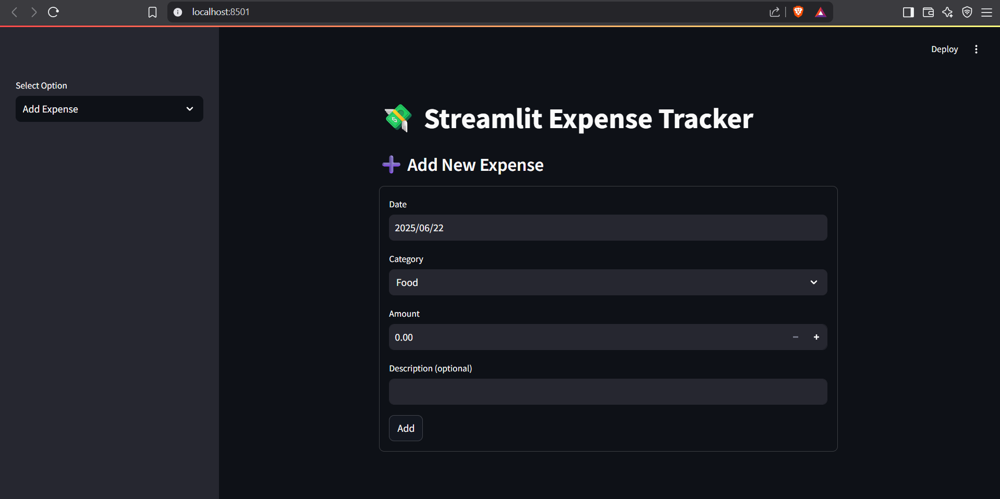
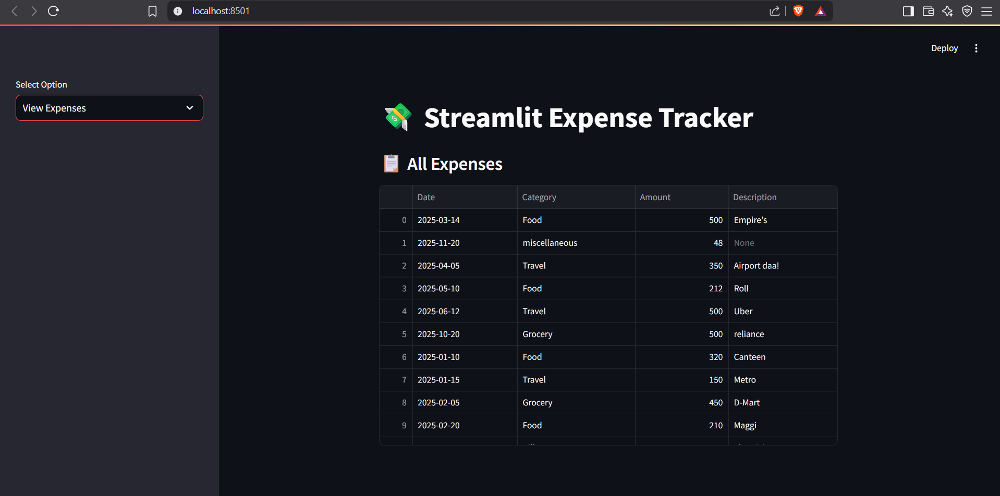
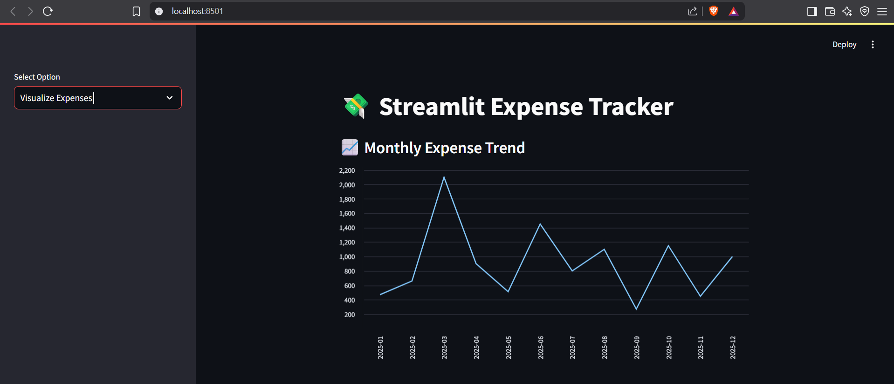
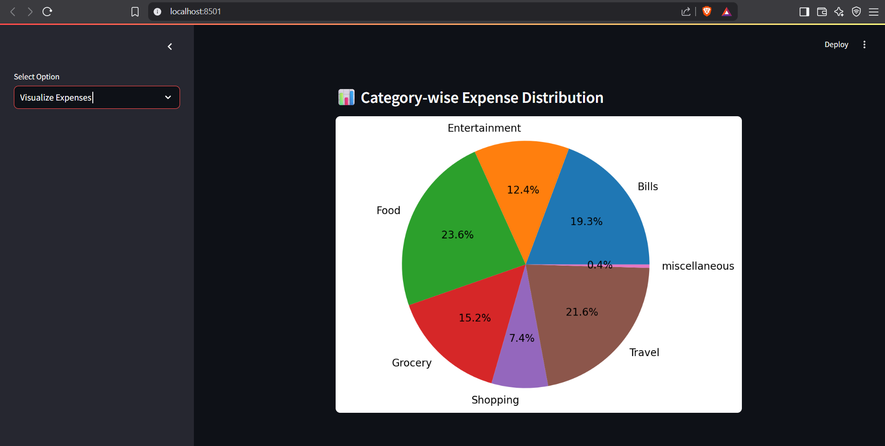

# 💸 Streamlit Expense Tracker

A web-based app to log, view, and visualize personal expenses.

## 🚀 Features
- Add daily expenses with date, category, amount, and description  
- View saved expenses in a table  
- Visualize spending by month and category (line + pie charts)

## 🛠️ Tech Stack
- Streamlit  
- Pandas  
- Matplotlib  

## 📸 Screenshots
### ➕ Add Expense Form

### 📋 View All Expenses

### 📈 Monthly Expense Trend

### 📊 Category-wise Distribution

